# 🚑 Régulation De Paris

## Introduction

The **Régulation De Paris** application was developed for the French Red Cross to assist with emergency first aid coordination in Paris. This voluntary service is unique in France, allowing Red Cross ambulances to operate with the same road priority as police, firefighters, and public hospital ambulances.

A room dedicated for RedCross Operators was custom-built fo this application, with a setup including 2 screens per computer,
3 computers, each equipped with ICOM Radios that can broadcast over Paris and surroundings (Ile de France).

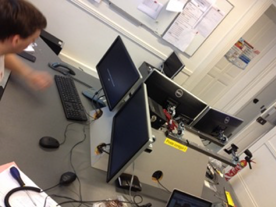
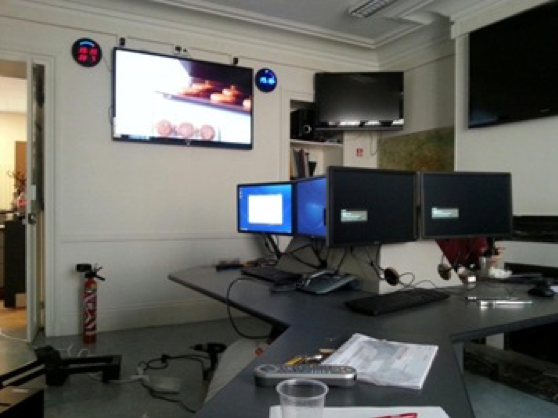

We used the (at that time) new ICOM numerical transceivers that had a digital channel where GPS coordinates of ambulances was transmitted
and integrated with Regulation de Paris

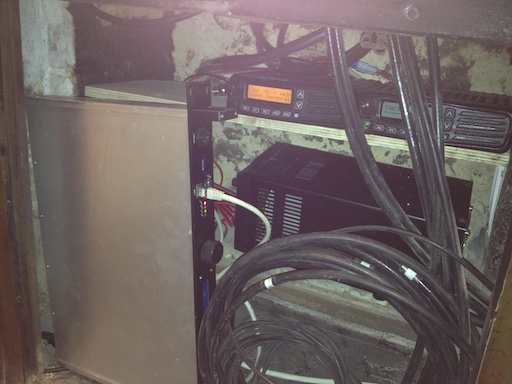    

Each weekend, 5 to 10 Red Cross ambulances, staffed by volunteers, support emergency services. Additionally, the Red Cross provides rescue teams for special events such as sports matches, public demonstrations, and other large gatherings.

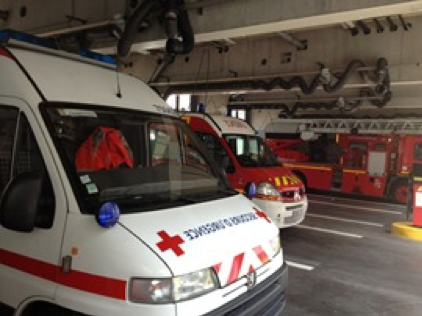   
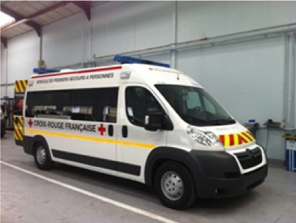

The **Régulation De Paris** app manages ambulance deployments and event coverage via a team of 2-3 coordinators, who communicate with the ambulances using digital radio transceivers.
A readonly access to the French Public Hopsital (SAMU) and Firefighters (Brigade des Sapeurs Pompiers de Paris) is implemented.

This project was ended due to Google Maps API v2 end of life, and the V3 was incompatible with ExtJS (display issue),
and at that time, my personnal free time was very low, but nonetheless, this great adventure allowed me to 
experiment many technologies that I introduce in my professionnal projects at RS2i.fr

## 🚀 Features

The application replaces paper-based systems, logging important data such as:
- **Patient information**: Including blood pressure, heart rate, breathing frequency, and treatment administered.
- **Hospital transfer details**: Destination hospital, timings, and a unique operation ID.
- **Ambulance management**: GPS tracking of ambulances and communication with the field teams.
- **CNIL declaration** : CNIL is the French government organism that ensure data is properly used. As we were storing medical 
  information with their victim's identification, we built a server room within the Paris headquaters, with secured badge access, encrypted hard drive and other similar requirements.

## 📷 Application Screenshots

Here are some screenshots showcasing the core features of the Régulation De Paris app:   

### 1. Victim Assignment
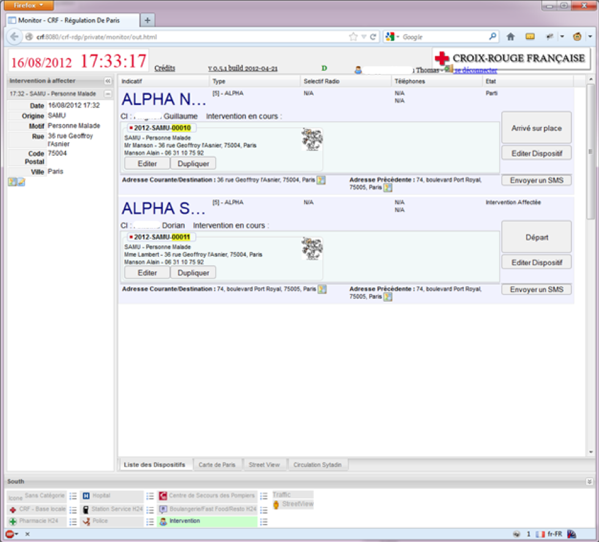
> Assign victims to ambulances via drag-and-drop (from the middle to the left). An SMS is sent to the ambulance driver and team leader with details such as name and address.

### 2. Google Maps Integration
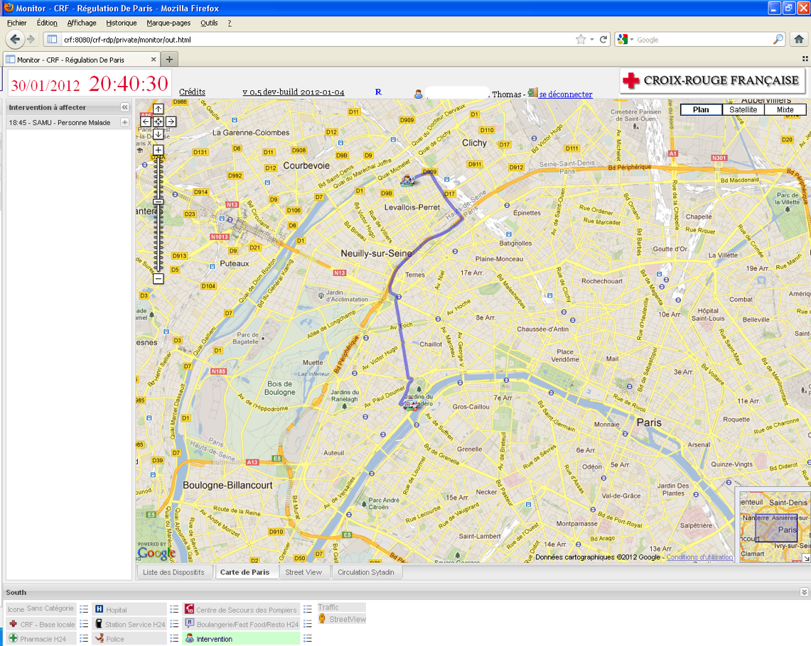
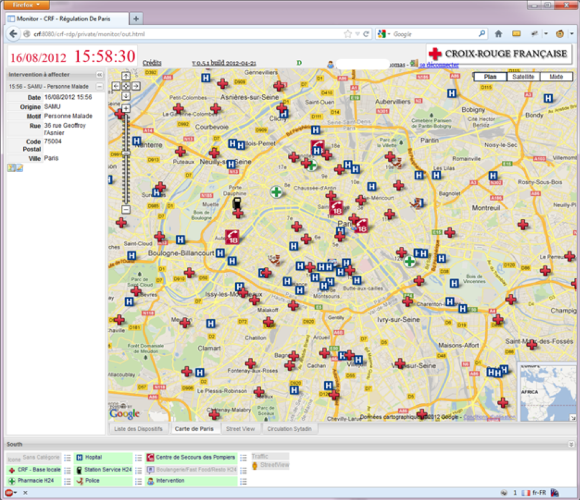
> The second tab displays Google Maps with control panels to filter what is shown on the map. Ambulances on the move are displayed
> As well as point of interest (hospitals, Pharamcy open H24, Gas Station open H24, RedCross local unit)

### 3. Traffic View
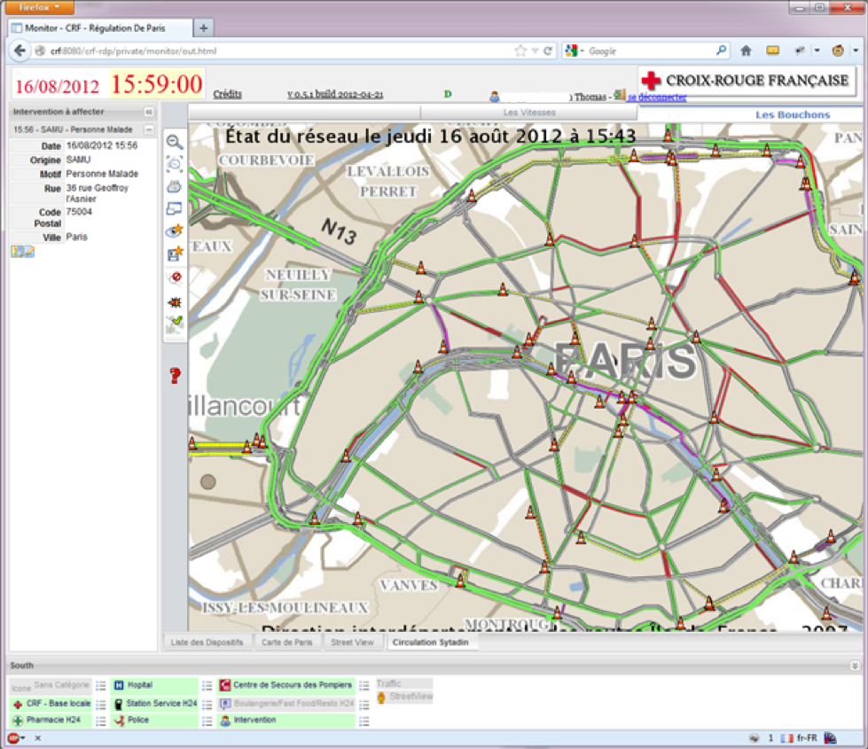
> Traffic data displayed through an iframe from Governement webiste. At that time, Google Maps didn't have the traffic overlay in France.

### 4. GPS Integration
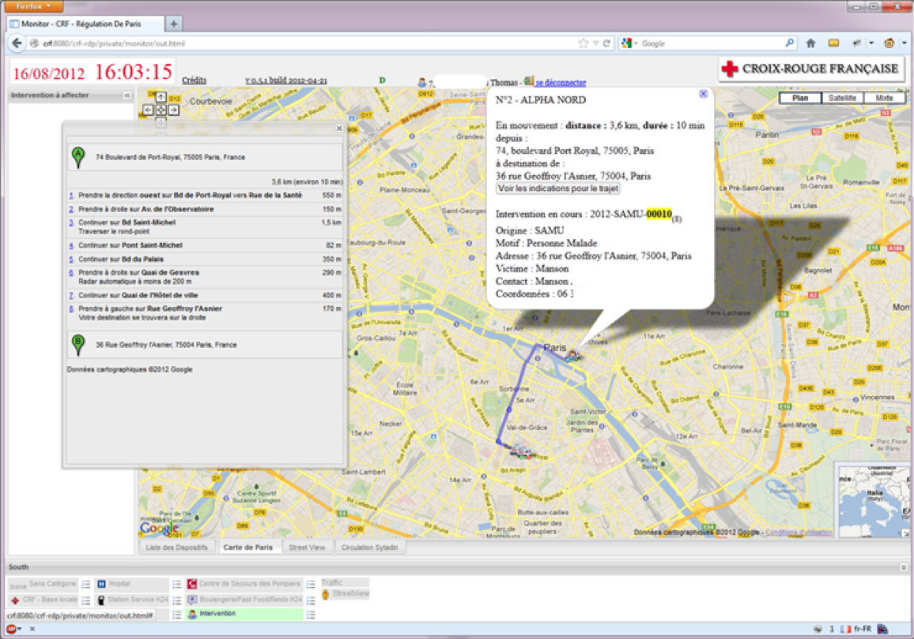
> Real-time GPS tracking of ambulances, showing start and end points, the Google estimated shortest path. Ambulance and victim details are shown in pop-up bubbles.

### 5. Medical Report
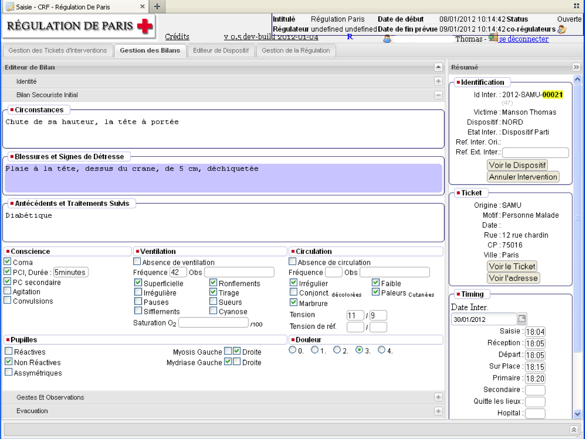
> Each victim's medical report is completed remotely via tablet and validated by the coordinator.

### 6. Volunteer Management
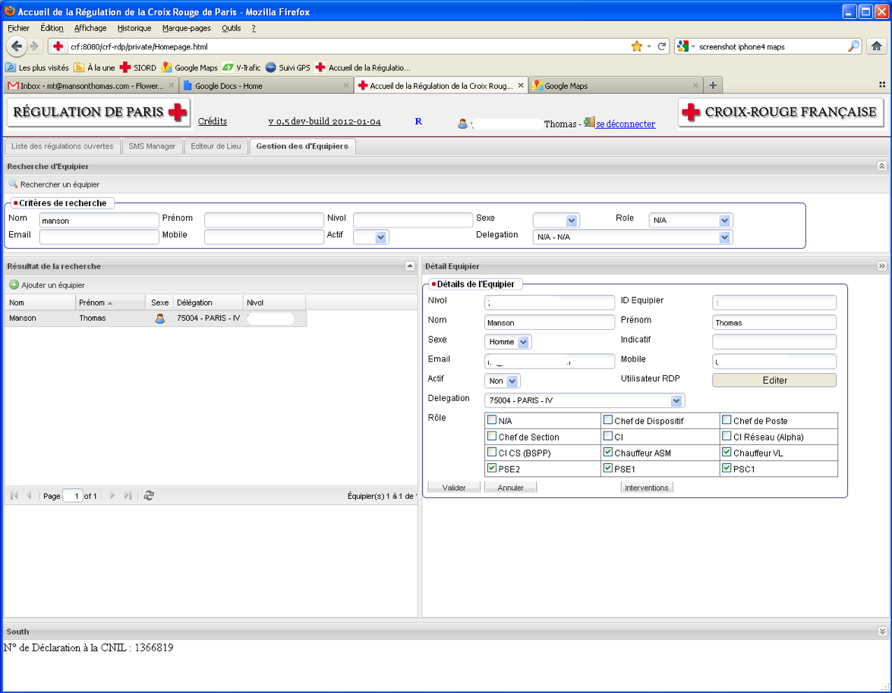
> Manage Red Cross volunteers, their roles, and access rights within the application.

## 🛠️ Technologies

The **Régulation De Paris** app is built with the following technologies:
- **Backend**: Ubuntu Server 12.04, JDK 1.7, Tomcat 7, Spring 3, DWR 3
- **Frontend**: ExtJS 3.4
- **Database**: MySQL 5.5
- **Version Control**: Bazaar DVCS https://code.launchpad.net/crf-irp
- **Other Tools**: Maven/Archiva, Jira (free license for open-source projects)

## 🚧 Future Enhancements

Several features (were) currently under development, including:
- **Digital transceiver integration**: Real-time GPS data from ambulances.
- **SMS Communication**: The app will send and receive SMS via a web API via integration for TIBCO EMS or Apache MQ, instead of direct API Call.
- **Android/iPad App**: A future mobile app may be developed for on-the-go use by field teams.

## 📬 Contact

For more information or to contribute, please contact:

**Thomas Manson**  
*Architect at TIBCO Software, Red Cross Volunteer*  
Email: [cv@mansonthomas.com](mailto:cv@mansonthomas.com)
